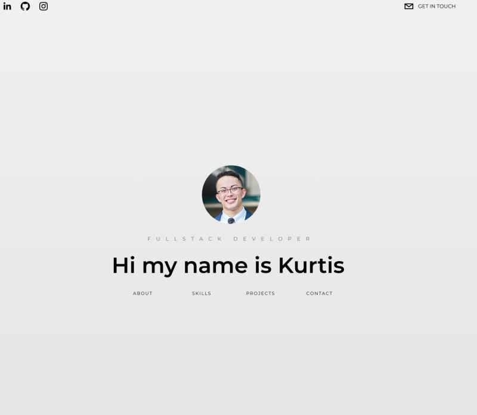

<!-- Improved compatibility of back to top link: See: https://github.com/othneildrew/Best-README-Template/pull/73 -->

<!--
*** Thanks for checking out the Best-README-Template. If you have a suggestion
*** that would make this better, please fork the repo and create a pull request
*** or simply open an issue with the tag "enhancement".
*** Don't forget to give the project a star!
*** Thanks again! Now go create something AMAZING! :D
-->

<!-- PROJECT SHIELDS -->
<!--
*** I'm using markdown "reference style" links for readability.
*** Reference links are enclosed in brackets [ ] instead of parentheses ( ).
*** See the bottom of this document for the declaration of the reference variables
*** for contributors-url, forks-url, etc. This is an optional, concise syntax you may use.
*** https://www.markdownguide.org/basic-syntax/#reference-style-links
-->

[![MIT License][license-shield]][https://github.com/git/git-scm.com/blob/main/mit-license.txt]
[![LinkedIn][linkedin-shield]][https://www.linkedin.com/in/kurtisivey/]

<!-- PROJECT LOGO -->
 

  <a href="https://github.com/github_username/repo_name">
    <h2>KI</h2>
  </a>

<h3 align="center">Portfolio v2</h3>
    

  

    Version 2 of my project portfolio website featuring my more current projects.
     
    <a href="https://github.com/KurtisIvey/portfolio.v2"><strong>Explore the Repo»</strong></a>
     
     
    <a href="https://kurtisivey.github.io/portfolio.v2/">View Demo</a>
    ·
  

<!-- TABLE OF CONTENTS -->

  
Table of Contents

  <ol>
    <li>
      <a href="#about-the-project">About The Project</a>
      <ul>
        <li><a href="#built-with">Built With</a></li>
      </ul>
    </li>
    <li><a href="#roadmap">Roadmap</a></li>
    <li><a href="#contributing">Contributing</a></li>
    <li><a href="#license">License</a></li>
    <li><a href="#contact">Contact</a></li>
  </ol>

<!-- ABOUT THE PROJECT -->

## About The Project

    
        

A new and updated portfolio website to give a more current display of my skillset and new projects. It is built with react and styled with tailwind. I opted to use react as I hadn't used it much in the past few months due to developing primarily server side, so I wanted to refresh my skills with it. In addition, I'm trying to build fluency with tailwind due to it speeding up one of the most time consuming aspects of my development(styling). Ensuring the proper responsiveness with tailwind was probably the most difficult part of this as I used the default width only breakpoints. This was very apparent to me once I flipped devices into landscape mode. So I opted to remove snap which was originally present and stay with smooth scroll features only.

(<a href="#readme-top">back to top</a>)

### Built With

(<a href="#readme-top">back to top</a>)

<!-- GETTING STARTED -->

## Roadmap

- [ ] Framer in motion utilized to allow elements to appear
- [ ] React smooth scroll is added for navigation
- [ ] The snap feature is utilized via the use of tailwind and present in the project section to allow for scrolling.
- [ ] A contact form is integrated into the page via emailJs that forwards the form content directly to my email

(<a href="#readme-top">back to top</a>)

<!-- CONTRIBUTING -->

## Contributing

Contributions are what make the open source community such an amazing place to learn, inspire, and create. Any contributions you make are **greatly appreciated**.

If you have a suggestion that would make this better, please fork the repo and create a pull request. You can also simply open an issue with the tag "enhancement".
Don't forget to give the project a star! Thanks again!

1. Fork the Project
2. Create your Feature Branch (`git checkout -b feature/AmazingFeature`)
3. Commit your Changes (`git commit -m 'Add some AmazingFeature'`)
4. Push to the Branch (`git push origin feature/AmazingFeature`)
5. Open a Pull Request

(<a href="#readme-top">back to top</a>)

<!-- LICENSE -->

## License

Distributed under the MIT License. See `LICENSE.txt` for more information.

(<a href="#readme-top">back to top</a>)

<!-- CONTACT -->

## Contact

Your Name - [@twitter_handle](https://twitter.com/IveyCodingBJJ) - kurtiveycodes@gmail.com

Project Link: [https://kurtisivey.github.io/portfolio.v2/]

(<a href="#readme-top">back to top</a>)

<!-- ACKNOWLEDGMENTS -->

(<a href="#readme-top">back to top</a>)

